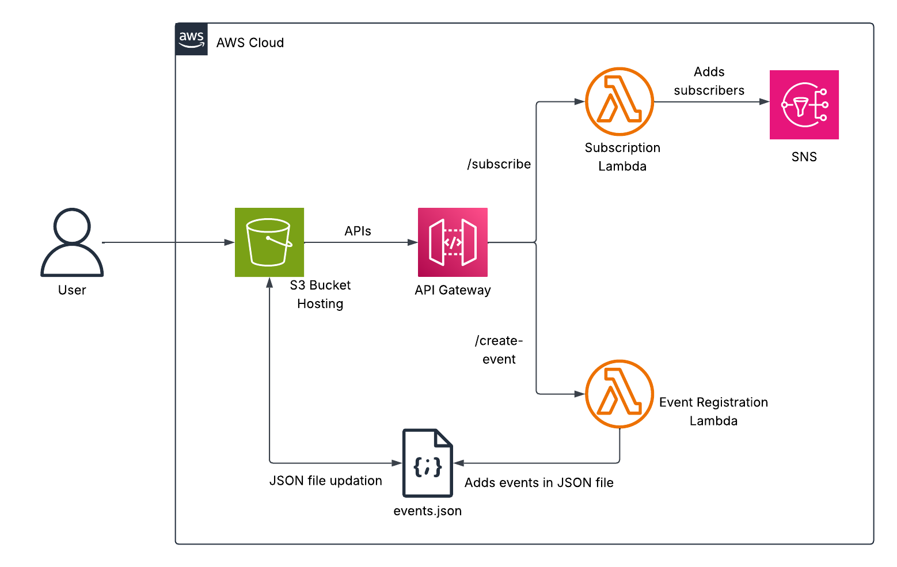
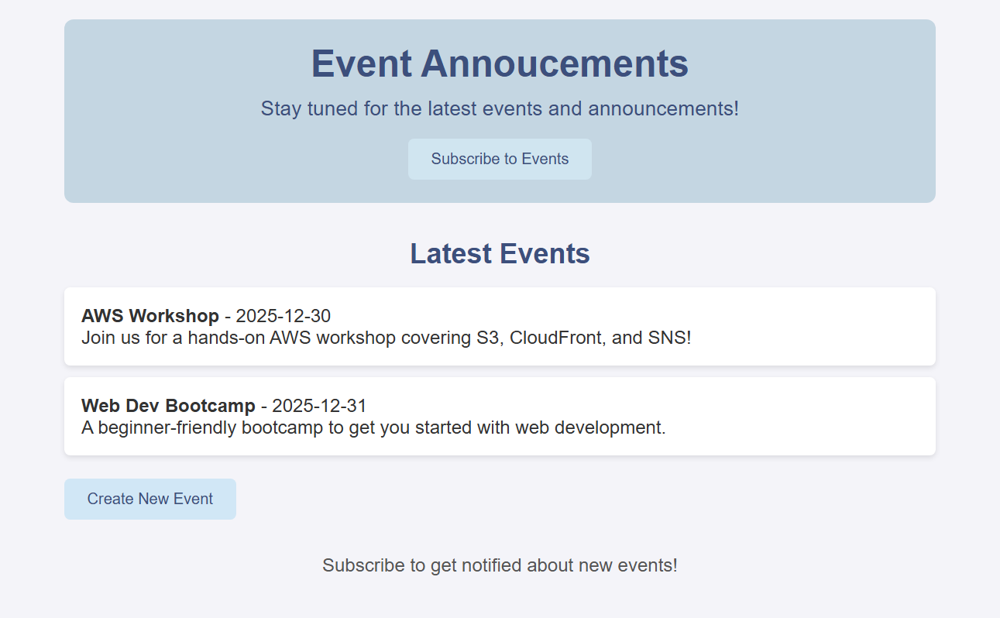

# AWS Event Announcement Website
A serverless application that allows users to register for events and subscribe for notifications. The project demonstrates static website hosting on **S3**, serverless backend with **AWS Lambda**, and event-driven processing via **SNS**. This project uses Infrastructure as Code with **AWS SAM**, and Python 3.12 for Lambda functions.

## Architecture Overview
  
*Figure 1: Architecture diagram of the AWS Event Announcement Website.*

**Core Components**  
- **Amazon S3** – Hosts the static website (HTML, CSS, JSON files).  
- **AWS Lambda** – Serverless functions for subscribing users and creating events.  
- **Amazon SNS** – Sends notifications to subscribers when new events are added.  
- **API Gateway** – Provides REST endpoints for `/subscribe` and `/create-event`.  
- **IAM** – Manages permissions for Lambda functions to access S3 and SNS.  
- **Python 3.12** – Runtime used for Lambda functions.  

## Skills Applied
- Building serverless applications with AWS Lambda and Python 3.12.  
- Implementing static website hosting with S3 and managing updates programmatically.  
- Automating subscriber notifications using SNS and Lambda integration.  
- Developing RESTful APIs with API Gateway and Lambda proxy integration.  
- Provisioning cloud infrastructure using AWS SAM templates.  
- Applying IAM roles, policies, and least-privilege permissions for secure deployments.  

## Features
- Static website hosted on S3 for event display and registration.  
- Add new subscribers via `/subscribe` endpoint.  
- Add new events via `/create-event` endpoint.  
- Automatic notifications to subscribers using SNS.  
- Serverless architecture for scalability and cost-efficiency.  

## Tech Stack
- **Languages:** Python 3.12  
- **AWS Services:** S3, Lambda, SNS, API Gateway, IAM  
- **IaC Tools:** SAM
- **Other Tools:** AWS CLI  

## Deployment Instructions
> **Note:** All command-line examples use `bash` syntax highlighting to maximize compatibility and readability.  
> If you are using PowerShell or Command Prompt on Windows, the commands remain the same but prompt styles may differ.

To provision the required AWS infrastructure, deploy using the included **SAM** template.

### **SAM**
1. Navigate to the `cloudformation` folder, build, and deploy:
   ```bash
   cd cloudformation
   sam build
   sam deploy --guided --capabilities CAPABILITY_NAMED_IAM
   ```

**Note**: Python 3.12 is recommended and tested for this project. Ensure your PATH environment variable includes the following entries (with priority above other Python versions):
- `..\Python312\`
- `..\Python312\Scripts`  

## How to Use
1. **Deploy the infrastructure** using SAM.  
2. **Edit** `index.html` file and add API endpoint URL, replacing `<YOUR_API_ENDPOINT_URL>`.  
3. **Upload static website files** (`index.html`, `styles.css`, `events.json`) to the S3 bucket. 
4. **Test the Lambda function directly**. The files `../src/events/announce_event.json` and `../src/events/subscribe_event.json` can be used to test the function.  

   **4a. Use the AWS CLI:**

     ```bash
     aws lambda invoke \
	 --function-name SubscribeToSNSFunction \
	 --invocation-type RequestResponse \
	 --payload fileb://../src/events/subscribe_event.json \
	 ../src/events/subscribe_response.json
     ```
	 
	 ```bash
     aws lambda invoke \
	 --function-name CreateEventFunction \
	 --invocation-type RequestResponse \
	 --payload fileb://../src/events/announce_event.json \
	 ../src/events/announce_response.json
     ```

   **4b. Use the AWS Management Console:**
   - Navigate to **Lambda** and select the function.  
   - Select **Test**.
	 - Select **Create new event**
   - Enter an **Event name**.
   - In Event JSON, enter the contents of the announce_event.json or subscribe_event.json file depending on the Lambda function selected.
   - Select **Test** in the upper right of the Test event dialog.

5. **Access the website** via the S3 static website URL.  
6. **Register subscribers** using the form, which triggers the Subscription Lambda to add emails to the SNS topic.  
7. **Add events** using the form, which triggers the Event Registration Lambda to update the `events.json` file in the S3 bucket and send notifications via SNS.  

## Project Structure
```plaintext
aws-event-announcement-website/
├── assets/                      # Images, diagrams, screenshots
│   ├── architecture-diagram.png      # Project architecture
│   └── application-screenshot.png    # Sample application screenshot
├── cloudformation/              # AWS SAM template
│   └── template.yaml                 # Main SAM template
├── src/                         # Lambda source code
│   └── subscribe_function/           # Subscribe Lambda
│       └── subscribe_lambda.py
│   └── announce_function/            # Announcement Lambda
│       └── announce_lambda.py
│	└── events/                       # Lambda test events
│   	├── announce_event.json      
│   	└── subscribe_event.json       
├── static/                      # Website resources
│   ├── events.json      		      # Event list
│   ├── index.html      			  # Site Homepage
│   └── styles.css                    # Website styling
├── LICENSE
├── README.md
└── .gitignore
```

## Screenshot


*Figure 2: Website with buttons "Subscribe to Events" and "Create New Event" that invoke Lambda functions*.

## Future Enhancements 
- Include **authentication** for event creation.  
- Extend support for **Terraform** to offer multi-IaC flexibility.  
- Add **unit tests** and **Lambda test events** for better **CI/CD** integration.  
- Add **CI/CD pipeline** with **GitHub Actions** for automated deployments.  
- Replace static hosting with **CloudFront + S3** for CDN and **HTTPS** support.  
- Add monitoring with **CloudWatch** logs and metrics dashboards.  

## License
This project is licensed under the [MIT License](LICENSE).  

## Author
**Patrick Heese**  
Cloud Administrator | Aspiring Cloud Engineer/Architect  
[LinkedIn Profile](https://www.linkedin.com/in/patrick-heese/) | [GitHub Profile](https://github.com/patrick-heese)

## Acknowledgments
This project was inspired by a course from [techwithlucy](https://github.com/techwithlucy).  
Lambda function logic and static website files were adapted from the course author’s original implementation. I extended the solution by enabling CORS headers.  
The architecture diagram included here is my own version, adapted from the original course diagram.  
I designed and developed all Infrastructure-as-Code (CloudFormation, SAM, Terraform) and project documentation.  
